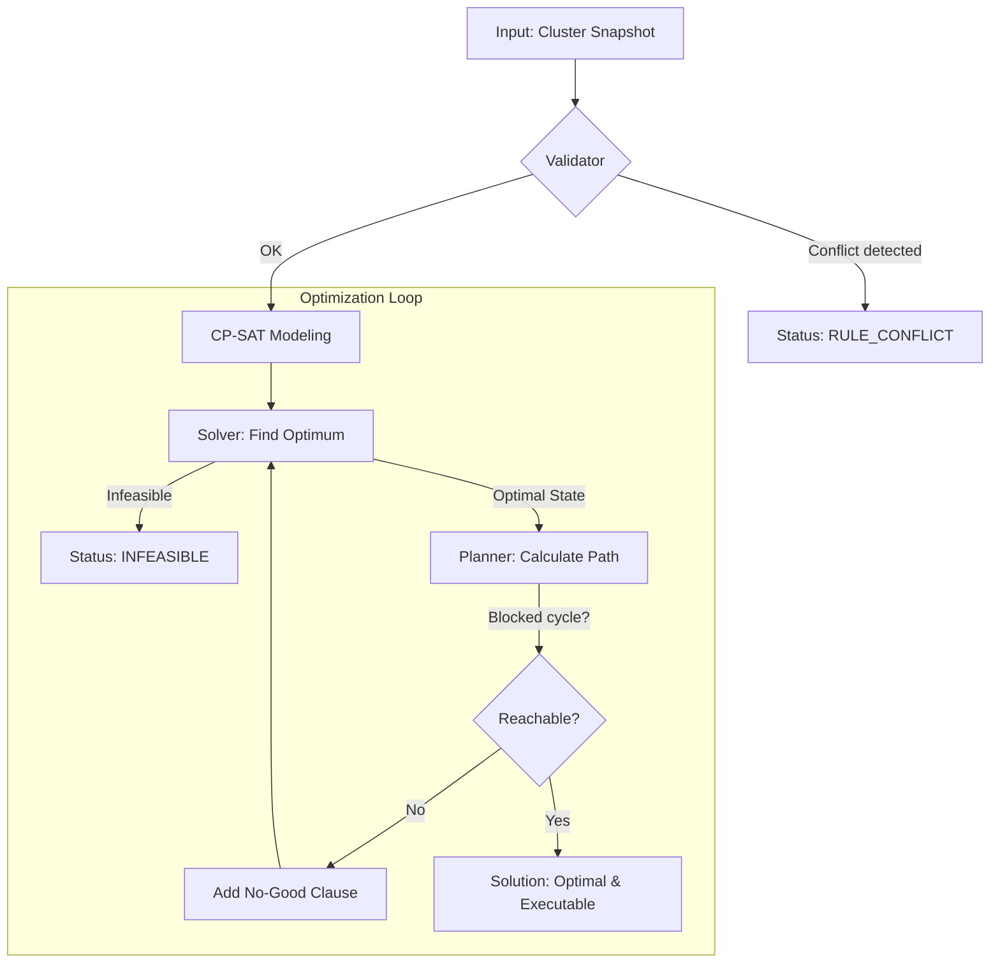

# ProxLB CP-SAT Solver


The ProxLB Solver is a mathematically exact scheduler for Proxmox VE clusters.
 It uses Google's **OR-Tools CP-SAT** to find the provably global optimum for VM and Container placement, moving beyond simple greedy heuristics.

## Algorithmic Overview



---

## 1. Mathematical Core

The solver treats guest placement as an **Integer Linear Programming (ILP)** problem.

### Decision Variables
For every guest $i$ (VM or Container) and node $j$, a binary variable $x_{i,j}$ is defined:
*   $x_{i,j} = 1$: Guest $i$ is assigned to node $j$.
*   $x_{i,j} = 0$: Guest $i$ is not assigned to node $j$.

Every guest must be assigned to exactly one node: $\sum_{j} x_{i,j} = 1$.

### Integer Arithmetic & Scaling
CP-SAT is an integer-only solver. To handle fractional values (like 0.5 CPU cores or 12.5% PSI), the solver internally scales all metrics by a factor of **10,000** (`_LOAD_SCALE`).
*   100% load is represented as 10,000.
*   0.5% PSI is represented as 50.
*   This scaling explains the large objective values seen in technical solver logs.

### Objective Function
The solver minimizes a weighted cost function:
$$\text{Minimize: } (w_\text{balance} \cdot \text{Spread}) + (w_\text{stickiness} \cdot \text{MigrationCost}) + \text{Penalty}_\text{SoftRules}$$

*   **Spread**: The difference between the most and least utilized node ($\text{Max} - \text{Min}$), scaled by total capacity.
*   **MigrationCost**: A weighted sum over all migrated guests — see §2 below.
*   **Penalty**: A massive malus ($1{,}000{,}000$) for every violated soft constraint.

---

## 2. Migration Cost Model

Migrating a guest has a real cost: RAM must be copied live over the network (dirty-page tracking); local disk requires a full sequential copy. The cost model reflects this:

$$\text{cost}(\text{Guest}) = \max(1,\ \lfloor \text{RAM} / 256\,\text{MiB} \rfloor) + 4 \times \lfloor \text{LocalDisk} / 256\,\text{MiB} \rfloor$$

The 256 MiB base unit gives enough granularity for the solver to distinguish between a 512 MiB guest (cost 2) and a 1 GiB guest (cost 4). The `max(1, …)` floor ensures tiny containers still have a non-zero weight.

The **4× local disk factor** reflects that copying a local disk (LVM/ZFS) is significantly slower than a RAM live-migration.

---

## 3. Resource Metrics & Strategy Modes

ProxLB supports multiple optimization dimensions via the `method` parameter:

| Method | Balance objective | Use Case |
| :--- | :--- | :--- |
| `memory` | RAM allocation | Classic memory-based balancing (default). |
| `cpu` | CPU load (cores) | Throughput optimization. |
| `disk` | Local storage usage | Disk capacity balancing across nodes. |
| `cpu_psi` | CPU stall time (PSI) | Latency optimization (PVE 9+). |
| `cpu_smart` | CPU load + PSI | Balance of throughput and responsiveness. |
| `global_smart` | RAM + CPU + IO | **Holistic cluster-wide optimization**. |

### RAM: configured allocation vs. actual RSS
The solver balances RAM by **configured allocation**, not actual RSS. This is correct for capacity planning — a VM configured with 4 GiB must be placed on a node that has 4 GiB reserved, regardless of its current usage.

### CPU: Usage vs. Assigned
- **Used Mode (Default)**: Balances based on the actual measured CPU load (`cpu_used`).
- **Assigned Mode**: Balances based on the *configured number of vCPUs*. This ensures that reserved compute capacity is distributed evenly.

### The PSI Footprint Model (CPU, RAM, IO)
For PSI metrics, the solver uses an **additive footprint model**. It tries to spread these contributions so that the aggregate pressure on each node stays as low and uniform as possible.

---

## 4. Weight Hierarchy

Optimization is fine-tuned via three distinct tiers:

1.  **Global Level (`w_global_*`)**: Importance of resource pools (e.g., "RAM balance is 10x more important than IO").
2.  **Resource Level (`w_*_usage` vs `w_*_psi`)**: Weighting raw utilization against dynamic pressure stalls.
3.  **Guest Level (`priority`)**:
    *   **Priority 3 (High)**: Footprint counts 3× towards the spread calculation.
    *   **Priority 1 (Low)**: Footprint counts 1×.
    *   *Effect*: High-priority guests "force" their way onto nodes with the most free resources by artificially inflating their perceived load during the optimization phase.

---

## 5. Constraints

### Hard Constraints (Strict)
Violations result in `INFEASIBLE`.
- **Capacity**: RAM, CPU cores (with overcommit), and named storage pools (ZFS, LVM).
- **Pinning**: Binding guests to specific hardware. **Pinning is always hard.**
- **Maintenance**: Nodes in maintenance mode are forbidden targets.
- **Hard Rules**: Affinity/Anti-Affinity marked as `hard: true`.

### Rule Origins & Specialized Handling
The solver distinguishes between rules based on their `origin`:

| Origin | Type | Handling | Rationale |
| :--- | :--- | :--- | :--- |
| `pve` | Native HA | **Atomic / Strict** | Proxmox enforces these rules automatically. |
| `plb` | Internal Tags | **Granular / Soft** | ProxLB manages these; allows flexible transitions. |

1.  **PVE Affinity (Atomic)**: Members of a native Proxmox affinity group are moved in the **same execution step**.
2.  **PVE Anti-Affinity (Strict)**: The planner ensures partners **never share a node** even for a split second during transitions.

---

## 6. Reachability Guarantee & Migration Planning

An optimal state is worthless if it cannot be executed (e.g., no buffer space for a swap). The Solver finds the *target state*, but the **Planner** determines the *safe path* to get there.

1.  **Dependency Analysis**: The Planner builds a directed graph where an edge $A \to B$ means "Guest A must move before Guest B can fit on its target node".
2.  **Step-by-Step Simulation**: Migrations are grouped into execution steps. For every step, the Planner simulates node capacities to ensure that no host is oversubscribed even during the transition.
3.  **Cycle Breaking (Temp-Moves)**: Circular dependencies (e.g., Guest-A $\leftrightarrow$ Guest-B swap) are detected. If a third "spare" node with sufficient capacity exists, the Planner inserts a **temp-move** (parking) to break the loop.
4.  **Atomic PVE Affinity**: For native Proxmox affinity groups, the Planner picks one "trigger" guest for the API call. It assumes Proxmox will co-migrate the other group members atomically and accounts for their total resource footprint in that single step.
5.  **Strict PVE Anti-Affinity**: To satisfy native PVE anti-affinity, the Planner ensures that partners **never** share a node, even temporarily. One must fully vacate the target before the other is allowed to land.
6.  **No-Good Feedback**: If a dependency cycle is mathematically unbreakable (e.g., cluster is too full for parking), the Planner rejects the solution. The Solver is then re-triggered with a "No-Good" constraint to find the next-best reachable state.

---

## 7. ProxLB Integration (Shadow & Active Mode)

The solver integrates with ProxLB via two operating modes:

### Shadow mode (default, read-only)
The solver runs alongside ProxLB's built-in balancer without changing anything. It produces a structured **JSONL log** and an **HTML report** for validation.

### Active mode
The solver takes over execution. ProxLB's `Balancing()` class is still used for API calls, but the solver determines the plan. A **feedback loop** handles migration failures by pinning failed guests and re-solving.

---

## Administrator Guide: Configuration & Defaults

The ProxLB Solver is tuned for **Stability over Agility** by default.

#### 1. Operational Safety
*   **`max_node_inflow` (Default: 1)**: Only one guest at a time can migrate *into* a host. This prevents memory or CPU peaks that could trigger OOM on the target host.
*   **`max_parallel_migrations` (Default: 2)**: Limits simultaneous migrations cluster-wide.
*   **`balanciness` (Default: 3 — Moderate)**:
    *   Level 1–2: Only moves guests for maintenance or hard rule violations.
    *   Level 3: Rebalances only if the spread exceeds ~15%.
    *   Level 5: Chases perfect balance.

#### 2. Resource Balancing Strategy
*   **`method` (Default: `memory`)**: RAM is usually the hardest bottleneck. Start with memory balancing before exploring CPU or Smart modes.
*   **`cpu_overcommit` (Default: 2.0)**: Allows assigning more vCPUs than physical cores exist.

---

## Usage for Developers

### Installation
```bash
make install
```

### Running Tests
```bash
make test
```

### Generating Reports
Integration results and shadow-mode comparisons can be visualized as interactive reports:
```bash
make report
```
This produces the following artifacts in the project root:
- `results.html`: Full interactive report with sidebar, Mermaid dependency graphs, and per-run detail pages.
- `results.md`: A concise Markdown summary of all processed runs.
- `results.xml`: JUnit-compatible XML for CI/CD integration.

Individual run logs are stored as `.jsonl` files in the configured `log_dir` (e.g., `/tmp/proxlb-solver-logs`).

### Internal Architecture
- **`models.py`**: Strict type definitions for the cluster state.
- **`adapter.py`**: Bridge between ProxLB's runtime data and the solver models.
- **`solver.py`**: Mathematical model and CP-SAT integration.
- **`planner.py`**: Topological sort and dependency resolution for migrations.
- **`shadow.py`**: Non-intrusive "shadow mode" for live cluster observation.
