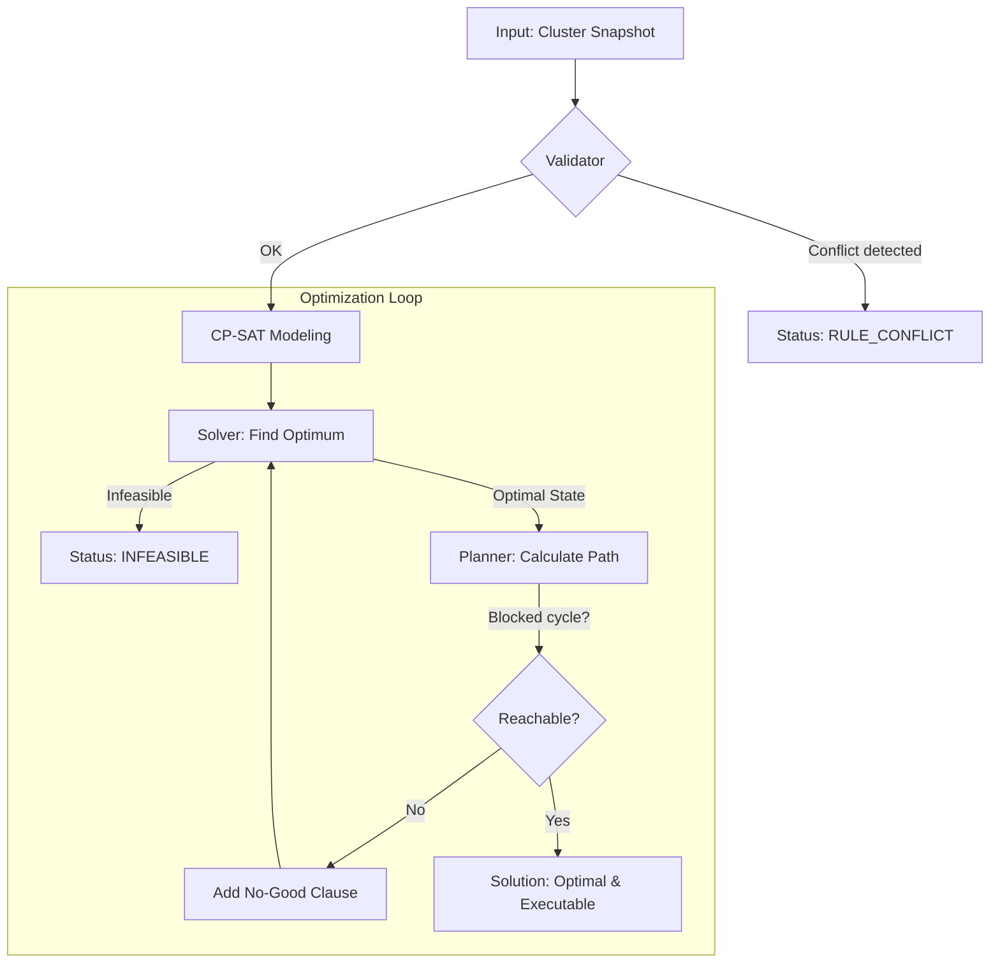

# ProxLB CP-SAT Solver

The ProxLB Solver is a mathematically exact scheduler for Proxmox VE clusters. It uses Google's **OR-Tools CP-SAT** to find the provably global optimum for VM placement, moving beyond simple greedy heuristics.

## Algorithmic Overview



---

## 1. Mathematical Core

The solver treats VM placement as an **Integer Linear Programming (ILP)** problem.

### Decision Variables
For every VM $i$ and node $j$, a binary variable $x_{i,j}$ is defined:
*   $x_{i,j} = 1$: VM $i$ is assigned to node $j$.
*   $x_{i,j} = 0$: VM $i$ is not assigned to node $j$.

Every VM must be assigned to exactly one node: $\sum_{j} x_{i,j} = 1$.

### Objective Function
The solver minimizes a weighted cost function:
$$Minimize: (w_{balance} \cdot LoadGap) + (w_{stickiness} \cdot MigrationCount) + Penalty_{SoftRules}$$

*   **LoadGap**: The difference between the most and least utilized node ($Max - Min$).
*   **MigrationCount**: The number of VMs whose target node differs from their current node.
*   **Penalty**: A massive malus ($1,000,000$) for every violated soft constraint.

---

## 2. Resource Metrics & "Smart" Modes

ProxLB supports multiple optimization dimensions via the `method` parameter:

| Method | Logic | Use Case |
| :--- | :--- | :--- |
| `memory` | RAM Usage (Bytes) | Classic memory-based balancing. |
| `cpu` | CPU Load (Average) | Throughput optimization. |
| `cpu_psi` | CPU Stall (Wait time) | Latency optimization (PVE 9+). |
| `cpu_smart` | Usage + PSI (Hybrid) | Balance of throughput and responsiveness. |
| `global_smart` | RAM + CPU + IO | **Holistic cluster-wide optimization**. |

### The PSI Footprint Model (CPU, RAM, IO)
[PSI (Pressure Stall Information)](https://www.kernel.org/doc/html/latest/accounting/psi.html) measures resource contention. Since PSI is an *intensive* metric (it doesn't sum up like RAM), the solver uses an **additive footprint model**:
1. Each VM has an individual pressure contribution (e.g., 10% stall time).
2. The solver projects node load as the sum of these contributions.
3. High-pressure VMs are actively moved away from nodes already reporting stalls.

---

## 3. Weight Hierarchy

Optimization is fine-tuned via three distinct tiers:

1.  **Global Level (`w_global_*`)**: Importance of resource pools (e.g., "RAM balance is 10x more important than IO").
2.  **Resource Level (`w_*_usage` vs `w_*_psi`)**: Weighting raw utilization against dynamic pressure stalls.
3.  **VM Level (`priority`)**: 
    *   **Priority 3 (High)**: Contribution counts 3x towards the gap calculation.
    *   **Priority 1 (Low)**: Contribution counts 1x.
    *   *Result*: Important VMs "force" their way onto the least loaded nodes.

---

## 4. Constraints

### Hard Constraints (Strict)
Violations result in `INFEASIBLE`.
- **Capacity**: RAM, CPU cores (with overcommit), and named Storage pools (ZFS, LVM).
- **Pinning**: Binding VMs to specific hardware. **Pinning is always hard.**
- **Maintenance**: Nodes in maintenance mode are forbidden targets.
- **Hard Rules**: Affinity/Anti-Affinity marked as `hard: true`.

### Soft Constraints (Preferred)
Violated only if resources are exhausted.
- **Soft Rules**: Affinity/Anti-Affinity marked as `hard: false`.
- The solver minimizes the number of soft violations if no perfect solution exists.

---

## 5. Security: The Reachability Guarantee

An optimal state is worthless if it cannot be executed (e.g., no buffer space for a swap).
1. The **Planner** verifies every solution for an executable migration path.
2. It detects dependencies (VM-A must move before VM-B can fit).
3. It detects cycles (A -> B -> A) and breaks them using **Temp-Moves** to spare nodes.
4. If a cycle is unbreakable, the state is marked as **"No-Good"**, and the solver searches for the next-best reachable solution.

---

## Live Simulation

Test the solver safely against your real cluster:

### Step 1: Export Cluster Data
Run the exporter (located in `scripts/export_proxlb_data.py`) from your ProxLB directory:
```bash
cd path/to/ProxLB/proxlb
python3 /path/to/proxlb-solver/scripts/export_proxlb_data.py /etc/proxlb.yaml /tmp/dump.json
```

### Step 2: Run Simulator
```bash
python3 -m proxlb_solver.simulate /tmp/dump.json
```

## Features Summary

- **CP-SAT optimization** — Exact solver finding provably optimal placements.
- **DRS-style balanciness** (1–5) — From conservative to aggressive.
- **Multi-faceted CPU Strategy** — vCPUs for limits, usage for balancing.
- **Named Storage Support** — Respects ZFS/LVM pool capacities.
- **Resource Reservations** — Protect host system stability.
- **Scenario-driven testing** — 90+ YAML scenarios covering all edge cases.

## Usage & Development

### Installation
```bash
python3 -m venv .venv
source .venv/bin/activate
pip install -e .
```

### Running Tests
```bash
make test
```

## YAML Scenario Format
Scenarios are located in `scenarios/`. They define nodes, VMs, and expected outcomes.
```yaml
nodes:
  node-A: {cpu_total: 16, memory_total_gb: 64}
vms:
  vm-1: {node: node-A, cpu: 4, memory_gb: 16, priority: 3}
balancing:
  method: global_smart
  balanciness: 5
```
