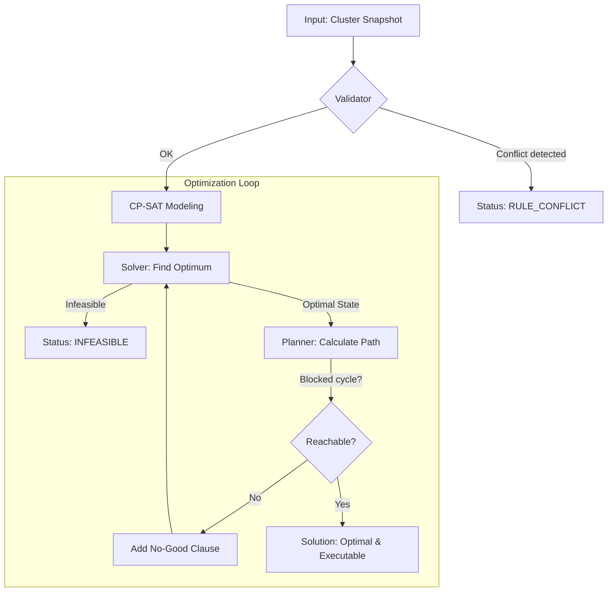

# ProxLB CP-SAT Solver

The ProxLB Solver is a mathematically exact scheduler for Proxmox VE clusters. It uses Google's **OR-Tools CP-SAT** to find the provably global optimum for VM placement, moving beyond simple greedy heuristics.

## Algorithmic Overview



---

## 1. Mathematical Core

The solver treats VM placement as an **Integer Linear Programming (ILP)** problem.

### Decision Variables
For every VM $i$ and node $j$, a binary variable $x_{i,j}$ is defined:
*   $x_{i,j} = 1$: VM $i$ is assigned to node $j$.
*   $x_{i,j} = 0$: VM $i$ is not assigned to node $j$.

Every VM must be assigned to exactly one node: $\sum_{j} x_{i,j} = 1$.

### Objective Function
The solver minimizes a weighted cost function:
$$\text{Minimize: } (w_\text{balance} \cdot \text{Spread}) + (w_\text{stickiness} \cdot \text{MigrationCost}) + \text{Penalty}_\text{SoftRules}$$

*   **Spread**: The difference between the most and least utilized node ($\text{Max} - \text{Min}$), scaled by total capacity.
*   **MigrationCost**: A weighted sum over all migrated VMs — see §2 below.
*   **Penalty**: A massive malus ($1{,}000{,}000$) for every violated soft constraint.

---

## 2. Migration Cost Model

Migrating a VM has a real cost: RAM must be copied live over the network (dirty-page tracking); local disk requires a full sequential copy. The cost model reflects this:

$$\text{cost}(\text{VM}) = \max(1,\ \lfloor \text{RAM} / 256\,\text{MiB} \rfloor) + 4 \times \lfloor \text{LocalDisk} / 256\,\text{MiB} \rfloor$$

The 256 MiB base unit gives enough granularity for the solver to distinguish between a 512 MiB VM (cost 2) and a 1 GiB VM (cost 4). The `max(1, …)` floor ensures tiny containers still have a non-zero weight.

The **4× local disk factor** reflects that copying a local disk (LVM/ZFS) is significantly slower than a RAM live-migration:
- A VM with 4 GiB RAM and no local disk: cost = 16 units
- A VM with 4 GiB RAM and 100 GiB local disk: cost = 16 + 1600 = 1616 units

**Consequence**: when multiple migrations achieve the same balance improvement, the solver automatically prefers moving the VM whose migration is cheapest — smaller RAM footprint and no local disk.

---

## 3. Resource Metrics & "Smart" Modes

ProxLB supports multiple optimization dimensions via the `method` parameter:

| Method | Logic | Use Case |
| :--- | :--- | :--- |
| `memory` | Configured RAM allocation | Classic memory-based balancing. |
| `cpu` | CPU load (average) | Throughput optimization. |
| `cpu_psi` | CPU stall (wait time) | Latency optimization (PVE 9+). |
| `cpu_smart` | Usage + PSI (hybrid) | Balance of throughput and responsiveness. |
| `global_smart` | RAM + CPU + IO | **Holistic cluster-wide optimization**. |

> **Note on configured vs. actual:** The solver balances by *configured* allocation (RAM size set in the VM config), not actual RSS. This is correct for capacity planning — a VM configured with 4 GiB must be placed on a node that has 4 GiB available, regardless of whether it currently uses only 200 MiB. The HTML report shows both values for transparency.

### The PSI Footprint Model (CPU, RAM, IO)
[PSI (Pressure Stall Information)](https://www.kernel.org/doc/html/latest/accounting/psi.html) measures resource contention. Since PSI is an *intensive* metric (it doesn't sum up like RAM), the solver uses an **additive footprint model**:
1. Each VM has an individual pressure contribution (e.g., 10% stall time).
2. The solver projects node load as the sum of these contributions.
3. High-pressure VMs are actively moved away from nodes already reporting stalls.

---

## 4. Weight Hierarchy

Optimization is fine-tuned via three distinct tiers:

1.  **Global Level (`w_global_*`)**: Importance of resource pools (e.g., "RAM balance is 10x more important than IO").
2.  **Resource Level (`w_*_usage` vs `w_*_psi`)**: Weighting raw utilization against dynamic pressure stalls.
3.  **VM Level (`priority`)**:
    *   **Priority 3 (High)**: Contribution counts 3× towards the spread calculation.
    *   **Priority 1 (Low)**: Contribution counts 1×.
    *   *Result*: Important VMs "force" their way onto the least loaded nodes.

---

## 5. Constraints

### Hard Constraints (Strict)
Violations result in `INFEASIBLE`.
- **Capacity**: RAM, CPU cores (with overcommit), and named storage pools (ZFS, LVM).
- **Pinning**: Binding VMs to specific hardware. **Pinning is always hard.**
- **Maintenance**: Nodes in maintenance mode are forbidden targets.
- **Hard Rules**: Affinity/Anti-Affinity marked as `hard: true`.

### Rule Origins & Specialized Handling
The solver distinguishes between rules based on their `origin`:

| Origin | Type | Handling | Rationale |
| :--- | :--- | :--- | :--- |
| `pve` | Native HA | **Atomic / Strict** | Proxmox enforces these rules automatically. |
| `plb` | Internal Tags | **Granular / Soft** | ProxLB manages these; allows flexible transitions. |

1.  **PVE Affinity (Atomic)**: Members of a native Proxmox affinity group are moved in the **same execution step**, even if this exceeds `max_parallel_migrations`. This prevents Proxmox from automatically pulling partners into a node that might be over capacity during a multi-step move.
2.  **PVE Anti-Affinity (Strict Ordering)**: If two VMs have native anti-affinity, the planner ensures they **never share a node** even for a split second. The partner must fully vacate the target node before the other VM is allowed to land.
3.  **Internal Rules (Flexible)**: Internal affinity groups (`plb`) are scheduled member-by-member to respect safety limits (`max_parallel_migrations`), providing better control over network and storage load.

### Soft Constraints (Preferred)
Violated only if resources are exhausted.
- **Soft Rules**: Affinity/Anti-Affinity marked as `hard: false`.
- The solver minimizes the number of soft violations if no perfect solution exists.

---

## 6. Reachability Guarantee

An optimal state is worthless if it cannot be executed (e.g., no buffer space for a swap).
1. The **Planner** verifies every solution for an executable migration path.
2. It detects dependencies (VM-A must move before VM-B can fit).
3. It detects cycles (A → B → A) and breaks them using **temp-moves** to spare nodes.
4. If a cycle is unbreakable, the state is marked as **"No-Good"**, and the solver searches for the next-best reachable solution.

---

## 7. ProxLB Integration (Shadow & Active Mode)

The solver integrates with ProxLB via two operating modes, configured with `solver.mode`:

### Shadow mode (default, read-only)
The solver runs alongside ProxLB's built-in balancer without changing anything. Every run produces a structured **JSONL log** and an **HTML report** comparing what the solver would have done against what ProxLB actually did. Useful for validation before enabling active mode.

### Active mode
The solver takes over execution. ProxLB's `Balancing()` class is still used for the actual API calls, but the solver determines which VMs move where.

A **feedback loop** handles migration failures:
1. Execute plan step-by-step via `Balancing()`.
2. After each step: verify actual VM placement via the Proxmox cluster API.
3. VMs that did not land on the expected node (CD-ROM attached, lock, resource conflict, …) are pinned to their current node.
4. Re-solve without the pinned VMs and retry — up to `active_max_retries` times.
5. Pinned VMs fall back to ProxLB's original plan (PVE HA handles affinity follow-up).

### JSONL event log

Every run appends structured events to a `.jsonl` file in `solver.log_dir`:

| Event | Description |
| :--- | :--- |
| `cluster_state` | Snapshot of node load and VM placement before solving |
| `solver_run` | Result: status, spread, migration cost, wall time |
| `plan_step` | One migration in the execution plan |
| `compare` | Diff between solver plan and ProxLB plan (shadow mode) |
| `active_step_result` | Success/failure of each migration in active mode |
| `active_retry` | Feedback loop retry: which VMs were pinned |
| `active_resolve` | Result of re-solve after pinning failed VMs |
| `active_complete` | Final outcome summary |

### HTML report

```bash
proxlb-solver-report --log-dir /var/log/proxlb/solver --output-dir /var/www/solver
```

The report follows the logical narrative of each run:

1. **Initial state** — configured allocation per node, VM distribution, spread before
2. **Solver migration plan** — which VMs move where, with RAM weight per migration
3. **Active Execution** — step-by-step results with retry sub-sections (active mode only)
4. **Result** — before/after allocation bars, spread improvement, VM distribution delta
5. **Comparison** — agreement/disagreement with ProxLB's own plan (shadow mode)

---

## Features Summary

- **CP-SAT optimization** — Exact solver finding provably optimal placements.
- **DRS-style balanciness** (1–5) — From conservative to aggressive rebalancing.
- **Memory-weighted migration cost** — Prefers smaller/RAM-only VMs when balance gain is equal; 4× penalty for local disk copies.
- **Multi-faceted CPU strategy** — vCPUs for limits, usage for balancing.
- **Named storage support** — Respects ZFS/LVM pool capacities.
- **Resource reservations** — Protect host system stability.
- **Shadow & active mode** — Observe-only or fully solver-driven execution with feedback loop.
- **Structured JSONL logging** — Machine-readable audit trail of every run.
- **HTML reports** — Per-run detail pages with initial state, plan, execution, and result sections.
- **79 YAML scenarios, 118 unit tests** — Covering all edge cases.

---

## ProxLB Integration

This package is designed to be used as an optional component of [ProxLB](https://github.com/credativ/ProxLB).
ProxLB loads it automatically when `solver.enable: True` is set in the configuration.

For installation instructions, configuration reference (shadow/active mode, log directory, retries),
and report generation, see the **[CP-SAT Solver section in the ProxLB README](https://github.com/credativ/ProxLB/blob/main/README.md#cp-sat-solver-optional)**.

---

## Usage & Development

### Installation
```bash
make install
```

### Running Tests
```bash
make test
```

### Generating Reports
```bash
make report
```

This produces:
- `results.html`: Interactive report with sidebar and graphs.
- `results.md`: Markdown summary.
- `results.xml`: JUnit XML for CI.

### Administrator Guide: Configuration & Defaults

The ProxLB Solver is tuned for **Stability over Agility** by default. This guide explains the key parameters and why specific defaults were chosen.

#### 1. Operational Safety (The "Quiet Cluster" approach)

Moving VMs creates transient load on the network, storage, and CPU. These settings protect your cluster from migration-induced instability:

*   **`max_node_inflow` (Default: 1)**: Only one VM at a time can migrate *into* a host. During the final switchover of a live migration, a VM briefly occupies resources on both source and target. Restricting inflow to 1 prevents memory or CPU peaks that could trigger OOM or performance degradation on the target host.
*   **`max_parallel_migrations` (Default: 2)**: Limits how many migrations can happen simultaneously across the entire cluster. Even with 10 nodes, starting with 2 keeps the management network and storage throughput predictable.
*   **`balanciness` (Default: 3 — Moderate)**:
    *   Level 1–2: Only moves VMs for maintenance or hard rule violations.
    *   Level 3: Rebalances only if the spread exceeds ~15%. This prevents "ping-pong" migrations due to minor metric fluctuations.
    *   Level 5: Chases perfect balance, which may cause frequent low-value migrations.

#### 2. Resource Balancing Strategy

*   **`method` (Default: `memory`)**: RAM is usually the hardest bottleneck in Proxmox clusters. Running out of RAM leads to swapping or OOM kills. Start with memory balancing before exploring CPU or Smart modes.
*   **`cpu_overcommit` (Default: 2.0)**: Allows assigning more vCPUs than physical cores exist. 2.0 is a conservative industry standard. Increase only if workloads are mostly idle.

#### 3. Weighted Optimization (Smart Modes)

If using `cpu_smart`, `memory_smart`, or `global_smart`, the solver uses a weighted hierarchy:

*   **PSI vs. Usage**: PSI (stall time) is weighted **2× higher** than raw usage (1×).
    *   *Why?* High usage is often intentional (throughput), but high PSI is always a problem (contention). The solver will prioritize moving a small VM that is thrashing over a large VM that is simply busy but performing well.
*   **Global Pool Priority**: In `global_smart` mode, RAM (10) > CPU (5) > IO (1).
    *   *Why?* RAM shortages are fatal. CPU shortages slow things down. IO is often bottlenecked by the storage backend, not node placement.

#### 4. VM Priorities (Shares)

Assign a `priority` (1–3) to VMs:
*   **Priority 3 (High)**: Critical production services.
*   **Priority 2 (Normal)**: Default.
*   **Priority 1 (Low)**: Test/dev environments.

The solver treats Priority 3 VMs as having a 3× larger footprint. This "forces" them onto the most idle nodes, effectively reserving the best hardware for the most important guests.

---

## Live Simulation
Test the solver safely against your real cluster:

1. **Snapshot Data**:
   ```bash
   cd path/to/ProxLB/proxlb
   python3 /path/to/proxlb-solver/scripts/export_proxlb_data.py /etc/proxlb.yaml /tmp/dump.json
   ```
2. **Run Simulator**:
   ```bash
   python3 -m proxlb_solver.simulate /tmp/dump.json
   ```

## YAML Scenario Format
Scenarios are located in `scenarios/`. They define nodes, VMs, and expected outcomes.
```yaml
nodes:
  node-A: {cpu_total: 16, memory_total_gb: 64}
vms:
  vm-1: {node: node-A, cpu: 4, memory_gb: 16, priority: 3}
  vm-2: {node: node-A, cpu: 2, memory_gb: 4,  disks: {local-lvm: 100}}
balancing:
  method: global_smart
  balanciness: 5
```
