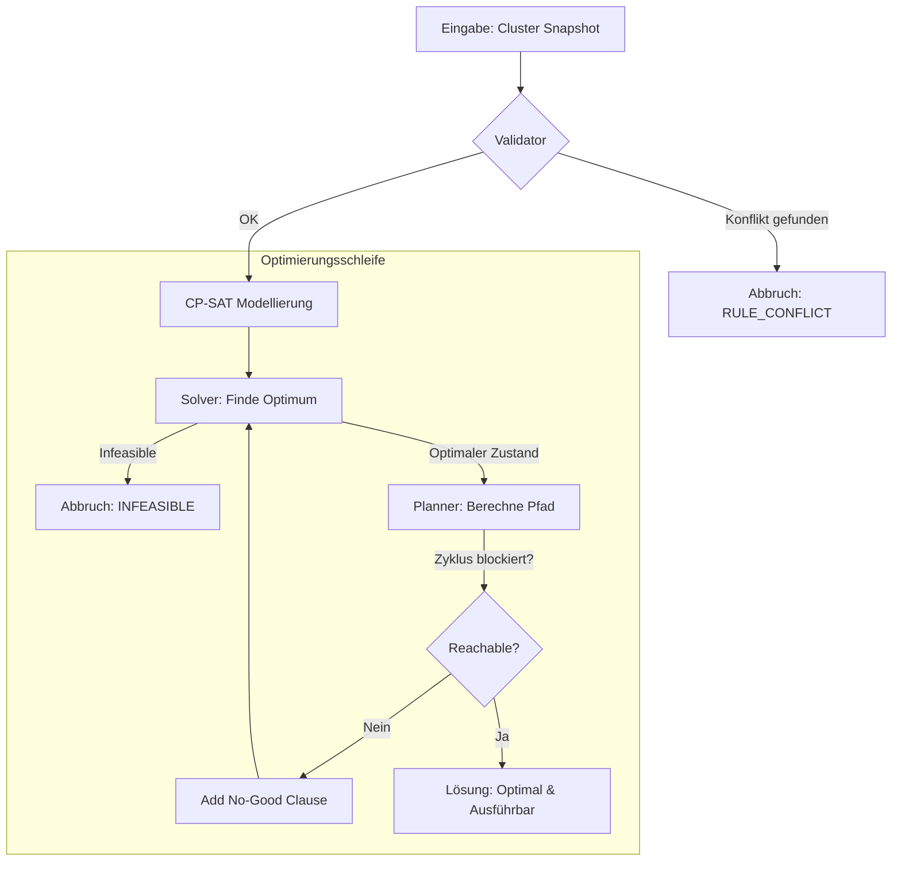

# ProxLB CP-SAT Solver

Der ProxLB Solver ist ein mathematisch exakter Scheduler für Proxmox VE Cluster. Er nutzt Googles **OR-Tools CP-SAT**, um das globale Optimum für die VM-Platzierung zu finden, anstatt sich auf einfache Heuristiken zu verlassen.

## Der Algorithmus auf einen Blick



---

## 1. Das mathematische Modell

Der Solver betrachtet die Platzierung als ein **Integer Linear Programming (ILP)** Problem. 

### Entscheidungs-Variablen
Für jede VM $i$ und jeden Knoten $j$ existiert eine binäre Variable $x_{i,j}$:
*   $x_{i,j} = 1$: VM $i$ wird auf Knoten $j$ platziert.
*   $x_{i,j} = 0$: VM $i$ wird nicht auf Knoten $j$ platziert.

Jede VM muss genau einem Knoten zugewiesen werden: $\sum_{j} x_{i,j} = 1$.

### Die Zielfunktion (Objective)
Der Solver minimiert folgende Kostenfunktion:
$$Minimize: (w_{balance} \cdot LoadGap) + (w_{stickiness} \cdot MigrationCount) + Penalty_{SoftRules}$$

*   **LoadGap**: Die Differenz zwischen dem am stärksten und am schwächsten ausgelasteten Knoten ($Max - Min$).
*   **MigrationCount**: Die Anzahl der VMs, deren Ziel-Knoten nicht dem aktuellen Knoten entspricht.
*   **Penalty**: Ein massiver Malus ($1.000.000$) für jede verletzte weiche Regel.

---

## 2. Ressourcen-Metriken & Modi

ProxLB unterstützt verschiedene Dimensionen der Optimierung, gesteuert über den Parameter `method`:

| Methode | Logik | Anwendungsfall |
| :--- | :--- | :--- |
| `memory` | RAM Usage (Bytes) | Klassisches RAM-Balancing. |
| `cpu` | CPU Load (Average) | Durchsatz-Optimierung. |
| `cpu_psi` | CPU Stall (Wartezeit) | Latenz-Optimierung (PVE 9+). |
| `cpu_smart` | Usage + PSI (Hybrid) | Beste Balance aus Last und Antwortzeit. |
| `global_smart` | RAM + CPU + IO | **Holistisches Cluster-Management**. |

### Das PSI Footprint Modell (CPU, RAM, IO)
[PSI (Pressure Stall Information)](https://www.kernel.org/doc/html/latest/accounting/psi.html) misst, wie lange Prozesse auf Ressourcen warten. Da PSI eine *intensive* Größe ist, nutzt der Solver ein **additives Fußabdruck-Modell**:
1. Jede VM hat einen individuellen Druck-Beitrag (z.B. 10% Stall-Zeit).
2. Der Solver projiziert die Knoten-Last als Summe dieser Beiträge.
3. VMs mit hohem Druck werden von Knoten wegbewegt, die bereits hohe Stall-Zeiten melden.

---

## 3. Das 3-stufige Gewichtungssystem

Die Optimierung wird über drei Ebenen feinjustiert:

1.  **Global-Ebene (`w_global_*`)**: Priorität der Ressourcen-Pools (z.B. "RAM-Balance ist wichtiger als IO-Performance").
2.  **Ressourcen-Ebene (`w_*_usage` vs `w_*_psi`)**: Verhältnis zwischen statischer Auslastung und dynamischem Druck.
3.  **VM-Ebene (`priority`)**: 
    *   **Prio 3 (High)**: Zählt 3x so viel in der Gap-Berechnung.
    *   **Prio 1 (Low)**: Zählt nur 1x.
    *   *Resultat*: Wichtige VMs "erzwingen" ihren Platz auf den leersten Knoten.

---

## 4. Regeln & Constraints

### Harte Constraints (Strict)
Verletzungen führen zu `INFEASIBLE`.
*   **Kapazität**: RAM, vCPU (inkl. Overcommit) und benannte Storages (ZFS, LVM).
*   **Pinning**: VMs an spezifische Hardware binden. **Pinning ist immer hart.**
*   **Maintenance**: Knoten im Wartungsmodus dürfen keine VMs beherbergen.
*   **Hard Rules**: Affinity/Anti-Affinity mit `hard: true`.

### Weiche Constraints (Preferred)
Werden nur bei Ressourcenmangel verletzt.
*   **Soft Rules**: Affinity/Anti-Affinity mit `hard: false`.
*   Der Solver wählt bei Engpässen die Lösung mit den wenigsten Regelverletzungen.

---

## 5. Sicherheit: Die Reachability-Garantie

Ein optimaler Zielzustand ist wertlos, wenn er nicht erreicht werden kann (z.B. weil kein Zwischenspeicher für einen Ring-Tausch vorhanden ist).

1. Der **Planner** prüft nach jeder Lösung, ob ein Migrationspfad existiert.
2. Er erkennt Abhängigkeiten (VM-A muss erst weg, bevor VM-B Platz hat).
3. Er erkennt Zyklen (A -> B -> A) und versucht sie durch **Temp-Moves** auf freie Knoten zu lösen.
4. Kann ein Zyklus nicht sicher gelöst werden, wird der Zustand als **"No-Good"** markiert und der Solver sucht die nächstbeste, erreichbare Lösung.

---

## Benutzung & Installation

### Live Simulation
Testen Sie den Solver sicher gegen einen echten Cluster:

1. **Snapshot erstellen**:
   ```bash
   cd ProxLB/proxlb
   python3 ../../scripts/export_proxlb_data.py /etc/proxlb.yaml /tmp/dump.json
   ```
2. **Simulator starten**:
   ```bash
   python3 -m proxlb_solver.simulate /tmp/dump.json
   ```

### Entwicklung & Tests
Der Solver wird über YAML-Szenarien gesteuert. Über 90 Tests decken alle oben genannten Logiken ab.
```bash
make test
```
