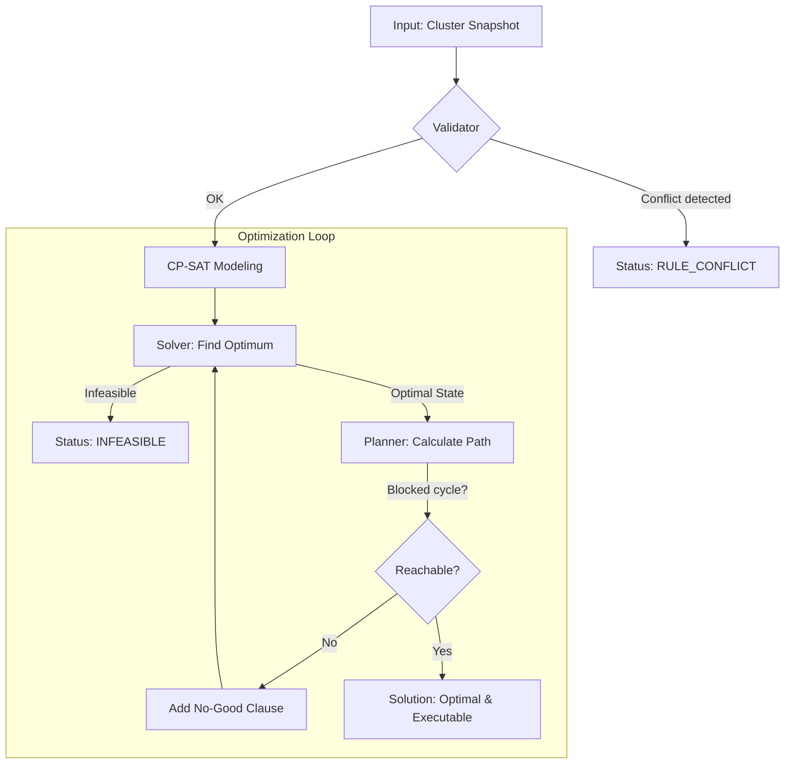

# ProxLB CP-SAT Solver

The ProxLB Solver is a mathematically exact scheduler for Proxmox VE clusters. It uses Google's **OR-Tools CP-SAT** to find the provably global optimum for VM placement, moving beyond simple greedy heuristics.

## Algorithmic Overview



---

## 1. Mathematical Core

The solver treats VM placement as an **Integer Linear Programming (ILP)** problem.

### Decision Variables
For every VM $i$ and node $j$, a binary variable $x_{i,j}$ is defined:
*   $x_{i,j} = 1$: VM $i$ is assigned to node $j$.
*   $x_{i,j} = 0$: VM $i$ is not assigned to node $j$.

Every VM must be assigned to exactly one node: $\sum_{j} x_{i,j} = 1$.

### Objective Function
The solver minimizes a weighted cost function:
$$Minimize: (w_{balance} \cdot LoadGap) + (w_{stickiness} \cdot MigrationCount) + Penalty_{SoftRules}$$

*   **LoadGap**: The difference between the most and least utilized node ($Max - Min$).
*   **MigrationCount**: The number of VMs whose target node differs from their current node.
*   **Penalty**: A massive malus ($1,000,000$) for every violated soft constraint.

---

## 2. Resource Metrics & "Smart" Modes

ProxLB supports multiple optimization dimensions via the `method` parameter:

| Method | Logic | Use Case |
| :--- | :--- | :--- |
| `memory` | RAM Usage (Bytes) | Classic memory-based balancing. |
| `cpu` | CPU Load (Average) | Throughput optimization. |
| `cpu_psi` | CPU Stall (Wait time) | Latency optimization (PVE 9+). |
| `cpu_smart` | Usage + PSI (Hybrid) | Balance of throughput and responsiveness. |
| `global_smart` | RAM + CPU + IO | **Holistic cluster-wide optimization**. |

### The PSI Footprint Model (CPU, RAM, IO)
[PSI (Pressure Stall Information)](https://www.kernel.org/doc/html/latest/accounting/psi.html) measures resource contention. Since PSI is an *intensive* metric (it doesn't sum up like RAM), the solver uses an **additive footprint model**:
1. Each VM has an individual pressure contribution (e.g., 10% stall time).
2. The solver projects node load as the sum of these contributions.
3. High-pressure VMs are actively moved away from nodes already reporting stalls.

---

## 3. Weight Hierarchy

Optimization is fine-tuned via three distinct tiers:

1.  **Global Level (`w_global_*`)**: Importance of resource pools (e.g., "RAM balance is 10x more important than IO").
2.  **Resource Level (`w_*_usage` vs `w_*_psi`)**: Weighting raw utilization against dynamic pressure stalls.
3.  **VM Level (`priority`)**: 
    *   **Priority 3 (High)**: Contribution counts 3x towards the gap calculation.
    *   **Priority 1 (Low)**: Contribution counts 1x.
    *   *Result*: Important VMs "force" their way onto the least loaded nodes.

---

## 4. Constraints

### Hard Constraints (Strict)
Violations result in `INFEASIBLE`.
- **Capacity**: RAM, CPU cores (with overcommit), and named Storage pools (ZFS, LVM).
- **Pinning**: Binding VMs to specific hardware. **Pinning is always hard.**
- **Maintenance**: Nodes in maintenance mode are forbidden targets.
- **Hard Rules**: Affinity/Anti-Affinity marked as `hard: true`.

### Rule Origins & Specialized Handling
The solver distinguishes between rules based on their `origin`:

| Origin | Type | Handling | Rationale |
| :--- | :--- | :--- | :--- |
| `pve` | Native HA | **Atomic / Strict** | Proxmox enforces these rules automatically. |
| `plb` | Internal Tags | **Granular / Soft** | ProxLB manages these; allows flexible transitions. |

1.  **PVE Affinity (Atomic)**: Members of a native Proxmox affinity group are moved in the **same execution step**, even if this exceeds `max_parallel_migrations`. This prevents Proxmox from automatically pulling partners into a node that might be over capacity during a multi-step move.
2.  **PVE Anti-Affinity (Strict Ordering)**: If two VMs have native anti-affinity, the planner ensures they **never share a node** even for a split second. The partner must fully vacate the target node before the other VM is allowed to land.
3.  **Internal Rules (Flexible)**: Internal affinity groups (`plb`) are scheduled member-by-member to respect safety limits (`max_parallel_migrations`), providing better control over network and storage load.

### Soft Constraints (Preferred)
Violated only if resources are exhausted.
- **Soft Rules**: Affinity/Anti-Affinity marked as `hard: false`.
- The solver minimizes the number of soft violations if no perfect solution exists.

---

## 5. Security: The Reachability Guarantee

An optimal state is worthless if it cannot be executed (e.g., no buffer space for a swap).
1. The **Planner** verifies every solution for an executable migration path.
2. It detects dependencies (VM-A must move before VM-B can fit).
3. It detects cycles (A -> B -> A) and breaks them using **Temp-Moves** to spare nodes.
4. If a cycle is unbreakable, the state is marked as **"No-Good"**, and the solver searches for the next-best reachable solution.

---

## Features Summary

- **CP-SAT optimization** — Exact solver finding provably optimal placements.
- **DRS-style balanciness** (1–5) — From conservative to aggressive.
- **Multi-faceted CPU Strategy** — vCPUs for limits, usage for balancing.
- **Named Storage Support** — Respects ZFS/LVM pool capacities.
- **Resource Reservations** — Protect host system stability.
- **Scenario-driven testing** — 90+ YAML scenarios covering all edge cases.
- **Rich Reports** — Interactive HTML with Mermaid graphs, Markdown, and JUnit XML.

## Usage & Development

### Installation
```bash
make install
```

### Running Tests
```bash
make test
```

### Generating Reports
```bash
make report
```

This produces:
- `results.html`: Interactive report with sidebar and graphs.
- `results.md`: Markdown summary.
- `results.xml`: JUnit XML for CI.

### Administrator Guide: Configuration & Defaults

The ProxLB Solver is tuned for **Stability over Agility** by default. This guide explains the key parameters and why specific defaults were chosen.

### 1. Operational Safety (The "Quiet Cluster" approach)

Moving VMs creates transient load on the network, storage, and CPU. These settings protect your cluster from migration-induced instability:

*   **`max_node_inflow` (Default: 1)**: This is the most important safety setting. It ensures that only one VM at a time can migrate *into* a host. During the final switchover of a live migration, a VM briefly occupies resources on both source and target. Restricting inflow to 1 prevents memory or CPU peaks that could trigger OOM or performance degradation on the target host.
*   **`max_parallel_migrations` (Default: 2)**: Limits how many migrations can happen simultaneously across the entire cluster. Even with 10 nodes, we recommend starting with 2 to keep the management network and storage throughput predictable.
*   **`balanciness` (Default: 3 - Moderate)**: 
    *   Level 1-2: Only moves VMs for maintenance or hard rule violations.
    *   Level 3: Rebalances only if the load gap exceeds 15%. This prevents "ping-pong" migrations where VMs move back and forth due to minor metric fluctuations.
    *   Level 5: Chases perfect balance, which may cause frequent, low-value migrations.

### 2. Resource Balancing Strategy

*   **`method` (Default: `memory`)**: RAM is usually the hardest bottleneck in Proxmox clusters. Running out of RAM leads to swapping or OOM kills. We recommend starting with memory balancing before exploring CPU or Smart modes.
*   **`cpu_overcommit` (Default: 2.0)**: Allows you to assign more vCPUs than physical cores exist. 2.0 is a conservative industry standard. Increase this only if your workloads are mostly idle.

### 3. Weighted Optimization (Smart Modes)

If using `cpu_smart`, `memory_smart`, or `global_smart`, the solver uses a weighted hierarchy:

*   **PSI vs. Usage**: We weight **PSI (Stall time) higher (2x)** than raw usage (1x). 
    *   *Why?* High usage is often intentional (throughput), but high PSI is always a problem (contention). The solver will prioritize moving a small VM that is "thrashing" over a large VM that is simply busy but performing well.
*   **Global Pool Priority**: In `global_smart` mode, we weight **RAM (10)** higher than **CPU (5)** and **IO (1)**.
    *   *Why?* RAM shortages are fatal. CPU shortages just slow things down. IO is often bottlenecked by the storage backend itself rather than node placement.

### 4. VM Priorities (Shares)

You can assign a `priority` (1-3) to your VMs:
*   **Priority 3 (High)**: Critical production services.
*   **Priority 2 (Normal)**: Default.
*   **Priority 1 (Low)**: Test/Dev environments.
The solver treats Priority 3 VMs as having a 3x larger footprint than they actually do. This "forces" the solver to place them on the most idle nodes, effectively reserving the best hardware for your most important guests.

## Live Simulation
Test the solver safely against your real cluster:

1. **Snapshot Data**:
   ```bash
   cd path/to/ProxLB/proxlb
   python3 /path/to/proxlb-solver/scripts/export_proxlb_data.py /etc/proxlb.yaml /tmp/dump.json
   ```
2. **Run Simulator**:
   ```bash
   python3 -m proxlb_solver.simulate /tmp/dump.json
   ```

## YAML Scenario Format
Scenarios are located in `scenarios/`. They define nodes, VMs, and expected outcomes.
```yaml
nodes:
  node-A: {cpu_total: 16, memory_total_gb: 64}
vms:
  vm-1: {node: node-A, cpu: 4, memory_gb: 16, priority: 3}
balancing:
  method: global_smart
  balanciness: 5
```
